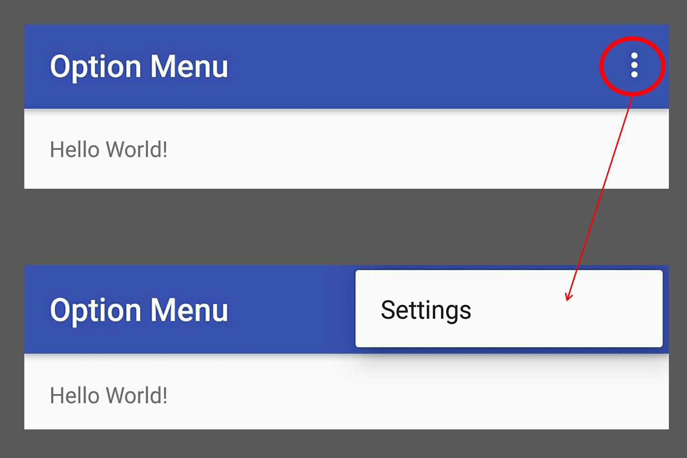
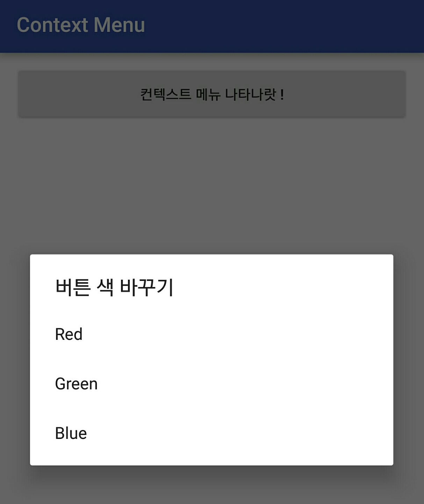
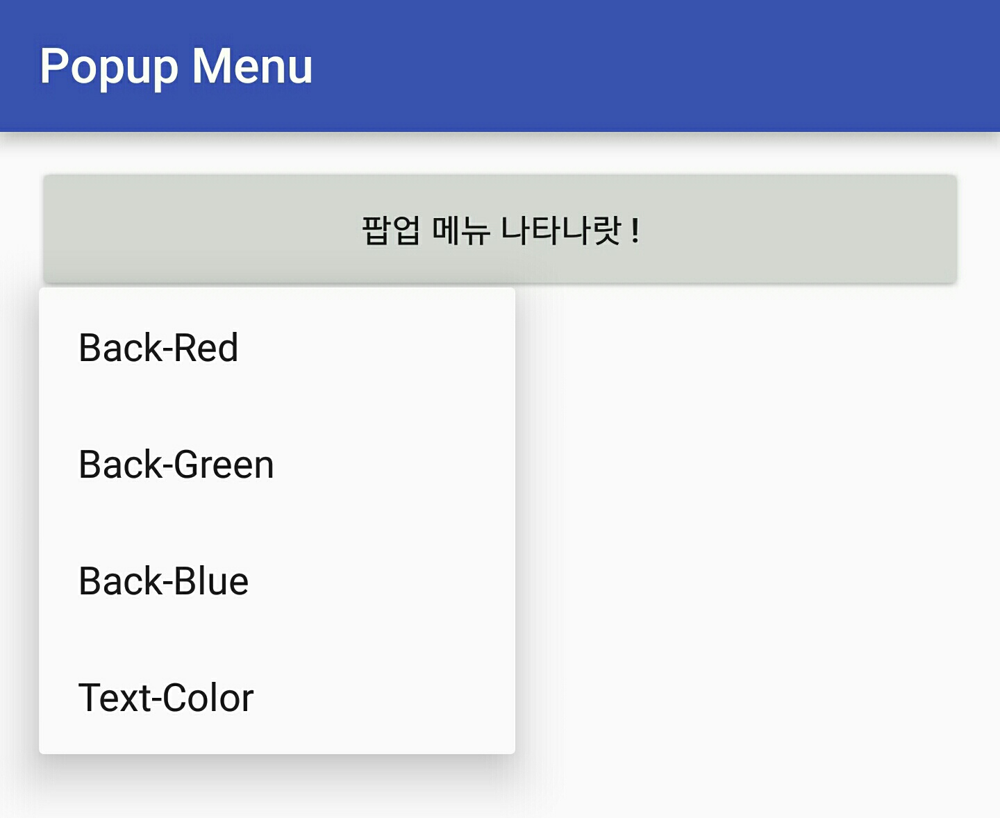
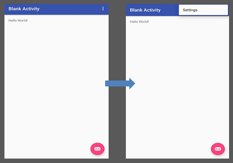
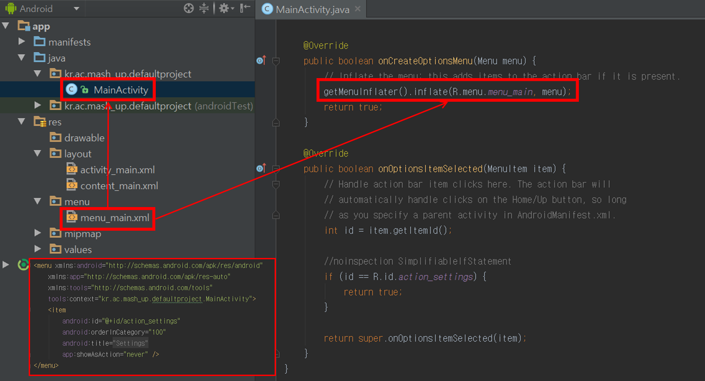
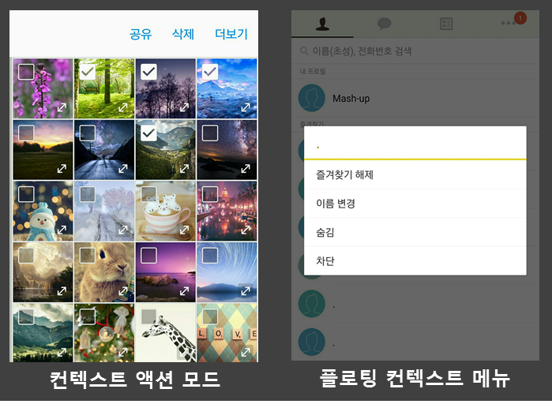
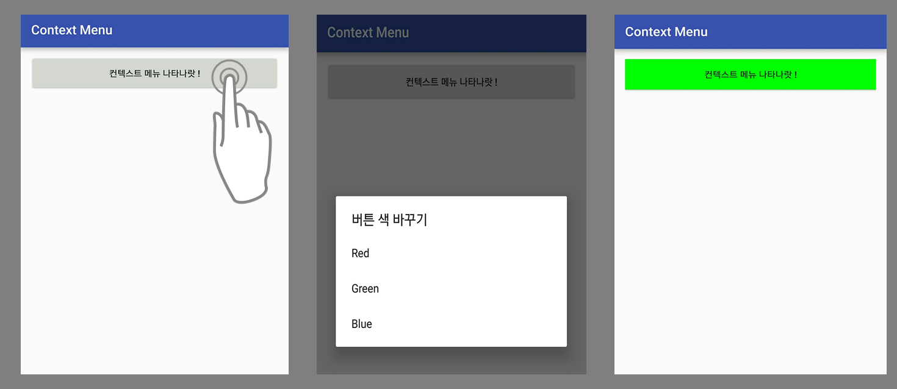

[toc]

# 메뉴(Menu)

메뉴는 프로그램이 제공하는 모든 명령을 계층적으로 표시하여 한눈에 살펴 볼 수 있으며 설명적인 캡션과 도움말을 제공하여 직관적이다. 

펼쳐 누르는 식이라 선택하기 쉽고 체크 박스나 흐림 표시로 프로그램의 현재 상태를 보여주기도 한다.

이번 장에서는 안드로이드가 지원하는 기본적인 3가지 메뉴에 대해 알아보고 실습해 볼 것이다.

|  옵션 메뉴(Option Menu)  |컨텍스트 메뉴(Context Menu)|팝업 메뉴(Popup Menu)|
| :--: | :--:| :--: |
||||


## 옵션 메뉴
액티비티의 주 메뉴이다.  프로그램의 주요 기능이나 설정 등의 명령을 배치하는 용도로 사용된다. 단순히 명령만 입력받으며 체크박스나 라디오 그룹으로 상태를 표현할 수 없다. 2.3 이하 버전에서는 사용자가 MENU 버튼을 누르면 옵션 메뉴가 나타났지만 3.0 이상 버전부터는 메뉴 버튼을 사용하지 않고 옵션 메뉴들이 액션바에 표시된다. 

옵션 메뉴는 우리가 Blank Activity로 새로운 프로젝트를 생성했을 때 이미 만들어져 있다. 





###옵션메뉴를 만들기 위해 필요한 3가지 메서드

><**public boolean OnCreateOptionsMenu(Menu menu)** >

>`최초 메뉴가 만들어질 때` 딱 한번만 호출되며 메뉴가 완성되면 다시 호출되지 않는다. 메뉴는 정적인 명령 집합이어서 한 번만 초기화되며 이 메서드에서 만든 메뉴를 계속 사용하는 것이 보통이다.

> <**public boolean OnPrepareOptionsMenu(Menu menu)** >

>`메뉴가 열릴 때마다` 호출되며 메뉴 항목을 추가하거나 뺄 수 있고 체크 상태나 사용 금지 등 메뉴 항목의 속성을 변경할 수도 있다. 메뉴가 처음 만든 형태 그대로 사용되고 별도의 속성을 조정할 필요가 없다면 굳이 재정의하지 않아도 상관없다.

><**public boolean OnOptionsItemSelected(MenuItem item)** >

>`사용자가 선택한 메뉴 항목을 처리` 한다. 인수로 전달되는 item 객체는 사용자가 선택한 메뉴 항목이다. 이 객체의 getItemId 메서드로 선택 항목의 ID를 조사하고 ID에 따라 적당한 명령을 수행한다. 


###XML로  메뉴 정의하기
메뉴의 모양을 정의하는 XML파일은 res/menu 폴더에 작성한다. 안드로이드 스튜디오에서는 [New] - [Menu resource file]을 선택한 후 원하는 파일명을 입력한다. 

``` 
<menu xmlns:android="http://schemas.android.com/apk/res/android">
    <item
        android:id="@+id/action_settings"
        android:orderInCategory="100"
        android:title="@string/action_settings"
        app:showAsAction="never" />
</menu>
```

-  menu : 메뉴를 나타내며 메뉴 항목을 저장하는 컨테이너이다. Menu 객체를 생성한다.
-  item : 하나의 메뉴 항목을 나타낸다. MenuItem 객체를 생성한다. menu를 내부에 가질 수 있어서 서브 메뉴를 생성할 수 있다.
-  group : item 요소들을 묶는 컨테이너이다.  


**<item의 속성>**
| 속성  |설명|
| :-- | :--|
|android:id|코드에서 메뉴 항목을 칭할 이름을 지정|
|android:title|메뉴 항목의 제목 문자열|
|android:titleCondensed|제목이 너무 길어 화면에 표시하기 어려울 때 대신 사용되는 짧은 제목|
|android:orderInCategory|같은 category에서 0(기본값)을 포함한 정수로 아이템간의 우선순위를 결정. 숫자가 낮을수록 위에 위치|
|android:icon|메뉴 항목에 같이 표시할 이미지를 지정|
|android:onClick|메뉴 항목을 선택했을 때 호출할 메서드를 지정|
|android:showAsAction|항목을 액션바에 배치하는 방식 |
|android:visible|항목이 보일 것인지를 지정 (유효값 : true, false)|
|android:enabled|항목의 활성화 여부를 지정 (유효값 : true, false)|
|android:checkable|항목을 체크할 수 있는지를 지정 (유효값 : true, false)|
|android:checked|항목의 체크 상태를 지정 (유효값 : true, false)|
|android:alphabeticShortcut|알파벳 단축키|
|android:numericShortcut|숫자 단축키|

###옵션 메뉴 실습하기


옵션 메뉴 실습은 일반메뉴,  선택메뉴, 서브메뉴, 아이콘메뉴 순으로 진행할 것이다. 먼저 Menu를 정의할 xml을 만든다. 

Empty Activity로 프로젝트를 생성한 경우 res/menu가 없다.  그런 경우, res에서 마우스 오른쪽 버튼을 눌러서 [New] - [Android rousource directory] - [resource type : menu]로 만들어주면 된다. 

**<일반 메뉴의 xml 구현 방식>**

``` 
<item
        android:id="@+id/op_normal"
        android:title="일반 메뉴" />
```

**<선택 메뉴의 xml 구현 방식>**
``` 
<item
        android:id="@+id/op_check"
        android:orderInCategory="1"
        android:checkable="true"
        android:checked="true"
        android:title="선택 메뉴" />
```
일반 메뉴의 경우,  android:orderInCategory가 정의 되어 있지 않다. 그럼 0(기본값)이 되어 선택메뉴의 "1"보다 우선순위가 높으므로 더 위에 위치하게 된다.

**<서브 메뉴의 xml 구현 방식>**
```
<item
        android:id="@+id/op_sub"
        android:title="서브 메뉴"
        android:orderInCategory="2">

        <menu>
            <item
                android:id="@+id/sub1"
                android:title="서브1" />
            <item
                android:id="@+id/sub2"
                android:title="서브2" />
        </menu>

    </item>
```
**<아이콘 메뉴의 xml 구현 방식>**
``` 
<menu
    xmlns:android="http://schemas.android.com/apk/res/android"
    xmlns:app="http://schemas.android.com/apk/res-auto">
  <item
        android:id="@+id/op_icon"
        android:title="아이콘 메뉴"
        android:icon="@drawable/img_iconmenu"
        app:showAsAction="always"/>
</menu>
```
메뉴 버튼을 눌러 나오는 창에서는 API 11부터, 즉 허니콤(3.0)부터는 아이콘이 나타나지 않는다. 대신 액션바를 이용해 아이콘을 표시할수 있다.

`showAsAction 속성`

| 속성  |설명|
| :-- | :--|
| always | 항상 액션바에 아이템을 추가하여 표시함 |
| never | 액션바에 아이템을 추가하여 표시하지 않음(기본값) |
| ifRoom | 액션바에 여유 공간이 있을 떄만 아이템을 표시함 |
| withText | title 속성으로 설정된 제목을 같이 표시 |
| collapseActionView | 아이템에 설정한 뷰(actionViewLayout으로 설정한 뷰)의 아이콘만 표시|


`Q. android:showAsAction와 app:showAsAction의 차이점?`

>**Answer** 
>If your app is using the Support Library for compatibility on versions as low as Android 2.1, the showAsAction attribute is not available from the android: namespace. 
>Instead you must define your own XML namespace and use that namespace as the attribute prefix. 

menu 정의가 끝났으면 MainActivity.java에서 메뉴 리소스를 실제 메뉴로 전개해주자.

``` 
 @Override
    public boolean onCreateOptionsMenu(Menu menu) {
        super.onCreateOptionsMenu(menu);

        MenuInflater inflater = getMenuInflater();
        inflater.inflate(R.menu.optionmenu, menu);
		
        return true;
    }

    @Override
    public boolean onOptionsItemSelected(MenuItem item) {
        super.onOptionsItemSelected(item);

        switch (item.getItemId()){
            case R.id.op_normal:
                Toast.makeText(this, "일반 메뉴가 선택됨.",Toast.LENGTH_SHORT).show();
                return true;
            case R.id.op_icon:
                Toast.makeText(this, "아이콘 메뉴가 선택됨.",Toast.LENGTH_SHORT).show();
                return true;
            case R.id.op_check:
                if (item.isChecked()){
                    item.setChecked(false);
                    Toast.makeText(this, "체크가 해제됨",Toast.LENGTH_SHORT).show();
                }else{
                    item.setChecked(true);
                    Toast.makeText(this, "체크 되었음.",Toast.LENGTH_SHORT).show();
                }
                return true;
            case R.id.sub1:
                Toast.makeText(this, "서브 메뉴 1번 선택됨.",Toast.LENGTH_SHORT).show();
                return true;
            case R.id.sub2:
                Toast.makeText(this, "서브 메뉴 2번 선택됨.",Toast.LENGTH_SHORT).show();
                return true;
        }
        return false;
    }
```

## 컨텍스트 메뉴
특정 뷰나 항목에 필요한 명령만 모아 놓은 지역적인 메뉴이다.  컨텍스트 메뉴는 2가지 형태로 제공된다. 



- **플로팅 컨텍스트 메뉴** : 사용자가 항목 위에서 롱 클릭을 하면 메뉴가 대화상자처럼 나타난다.
- **컨텍스트 액션 모드** : 현재 선택된 항목에 관련된 메뉴가 액션바에 표시된다. 여러 항목을 선택하여 특정한 액션을 한꺼번에 적용할 수 있다. 안드로이드 3.0 (API 11) 이상 버전에서만 사용 가능하다.

###플로팅 컨텍스트 기초 실습


**<컨텍스트 메뉴 등록하기>**
``` 
@Override
    protected void onCreate(Bundle savedInstanceState) {
        super.onCreate(savedInstanceState);
        setContentView(R.layout.activity_main);

        btn_cm = (Button) findViewById(R.id.btn_contextmenu);
        registerForContextMenu(btn_cm);
    }
``` 

미리 등록해야 컨텍스트 메뉴 생성을 메소드가 적절할 때 호출된다. 보통 액티비티 onCreate() 메서드에서 등록하며 여러 개의 뷰를 동시에 등록할 수 있다. 

**<컨텍스트 메뉴 생성하기>**
``` 
@Override
    public void onCreateContextMenu(ContextMenu menu, View v, ContextMenu.ContextMenuInfo menuInfo) {
        super.onCreateContextMenu(menu, v, menuInfo);

        if (v == btn_cm){
            menu.setHeaderTitle("버튼 색 바꾸기");
            menu.add(0, 1, 0, "Red").setIcon(R.drawable.radio_ch2);
            menu.add(0, 2, 0, "Green");
            menu.add(0, 3, 0, "Blue");
        }
    }
``` 

여러 개의 뷰를 등록해 놓을 수 있으므로 롱 클릭이 발생한 뷰 객체가 두번째 인수로 전달된다.  menuInfo 인수는 표시해야 할 메뉴에 대한 세부 정보인데 뷰에 따라 제공되는 정보가 달라진다. 

처음 한번만 호기화되는 옵션 메뉴와는 달리 onCreateContextMenu 메서드는 메뉴가 필요할 때마다 매번 호출된다. 

`자바코드로 메뉴를 추가하는 방법 !`
>**Menu.add(groupId, itemId, order, title);**
>- groupId : 그룹 ID를 지정하며, Menu에서 사용할수 있는 그룹 옵션을 사용할때 쓰임
>- itemId : Menu 각각의 item의 ID를 지정
>- order : item의 순서이며, android:orderInCategory와 같음
>- title : item의 Title

**<컨텍스트 메뉴 항목 클릭하기>**
``` 
@Override
    public boolean onContextItemSelected(MenuItem item) {
        switch (item.getItemId()){
            case 1:
                btn_cm.setBackgroundColor(Color.RED);
                return true;
            case 2:
                btn_cm.setBackgroundColor(Color.GREEN);
                return true;
            case 3:
                btn_cm.setBackgroundColor(Color.BLUE);
                return true;
        }
        return true;
    }
``` 
###플로팅 컨텍스트 활용 실습


### Checkbox
You can use `- [ ]` and `- [x]` to create checkboxes, for example:

- [x] Item1
- [ ] Item2
- [ ] Item3

> **Note:** Currently it is only partially supported. You can't toggle checkboxes in Evernote. You can only modify the Markdown in Marxico to do that. Next version will fix this.  


### Dancing with Evernote

#### Notebook & Tags
**Marxico** add `@(Notebook)[tag1|tag2|tag3]` syntax to select notebook and set tags for the note. After typing `@(`, the notebook list would appear, please select one from it.  

#### Title
**Marxico** would adopt the first heading encountered as the note title. For example, in this manual the first line `Welcome to Marxico` is the title.

#### Quick Editing
Note saved by **Marxico** in Evernote would have a red ribbon button on the top-right corner. Click it and it would bring you back to **Marxico** to edit the note. 

> **Note:** Currently **Marxico** is unable to detect and merge any modifications in Evernote by user. Please go back to **Marxico** to edit.

#### Data Synchronization
While saving rich HTML content in Evernote, **Marxico** puts the Markdown text in a hidden area of the note, which makes it possible to get the original text in **Marxico** and edit it again. This is a really brilliant design because:

- it is beyond just one-way exporting HTML which other services do;
- and it avoids privacy and security problems caused by storing content in a intermediate server. 

> **Privacy Statement: All of your notes data are saved in Evernote. Marxico doesn't save any of them.** 

#### Offline Storage
**Marxico** stores your unsynchronized content locally in browser storage, so no worries about network and broswer crash. It also keeps the recent file list you've edited in `Document Management(Ctrl + O)`.

> **Note:** Although browser storage is reliable in the most time, Evernote is born to do that. So please sync the document regularly while writing.

## Shortcuts
Help    `Ctrl + /`
Sync Doc    `Ctrl + S`
Create Doc    `Ctrl + Alt + N`
Maximize Editor    `Ctrl + Enter`
Preview Doc `Ctrl + Alt + Enter`
Doc Management    `Ctrl + O`
Menu    `Ctrl + M`

Bold    `Ctrl + B`
Insert Image    `Ctrl + G`
Insert Link    `Ctrl + L`
Convert Heading    `Ctrl + H`

## About Pro
**Marixo** offers a free trial of 10 days. After that, you need to [purchase](http://marxi.co/purchase.html) the Pro service. Otherwise, you would not be able to sync new notes. Previous notes can be edited and synced all the time.

## Credits
**Marxico** was first built upon [Dillinger][5], and the newest version is almost based on the awesome [StackEdit][6]. Acknowledgments to them and other incredible open source projects!

## Feedback & Bug Report
- Twitter: [@gock2][7]
- Email: <hustgock@gmail.com>

----------
Thank you for reading this manual. Now please press `Ctrl + M` and click `Link with Evernote`. Enjoy your **Marxico** journey!


[^demo]: This is a demo footnote. Read the [MultiMarkdown Syntax Guide](https://github.com/fletcher/MultiMarkdown/wiki/MultiMarkdown-Syntax-Guide#footnotes) to learn more. Note that Evernote disables ID attributes in its notes , so `footnote` and `TOC` are not actually working. 

  [1]: http://marxi.co/client_en
  [2]: https://chrome.google.com/webstore/detail/kidnkfckhbdkfgbicccmdggmpgogehop
  [3]: http://bramp.github.io/js-sequence-diagrams/
  [4]: http://adrai.github.io/flowchart.js/
  [5]: http://dillinger.io
  [6]: http://stackedit.io
  [7]: https://twitter.com/gock2

